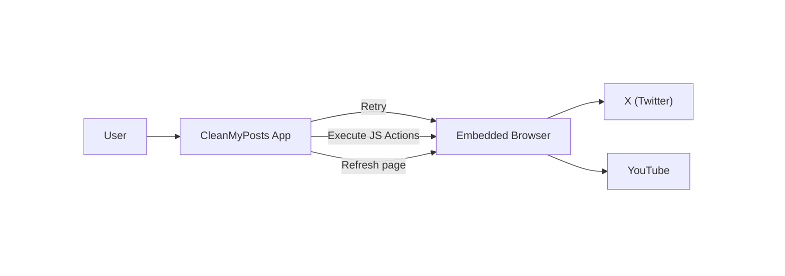
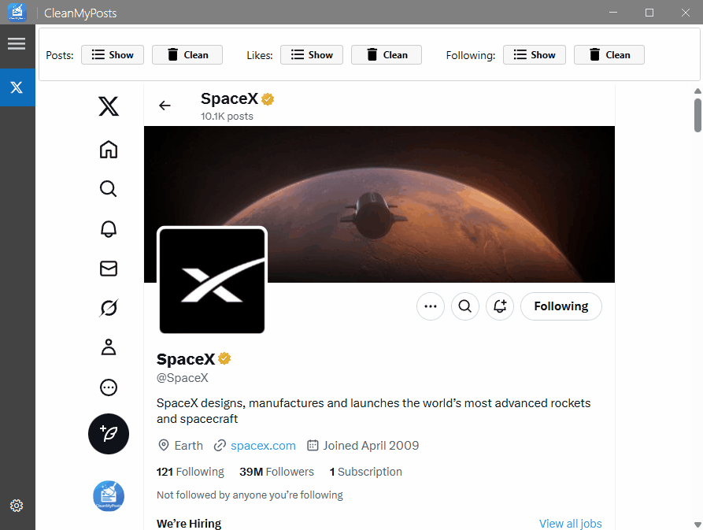
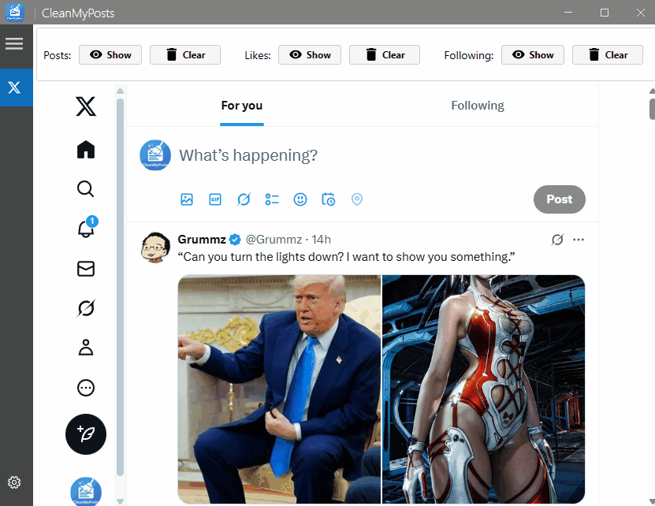
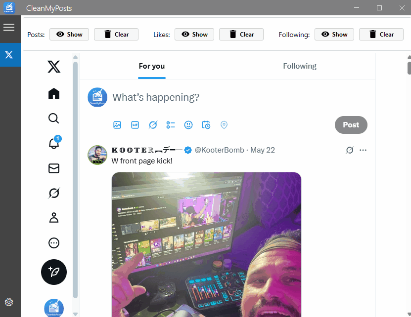
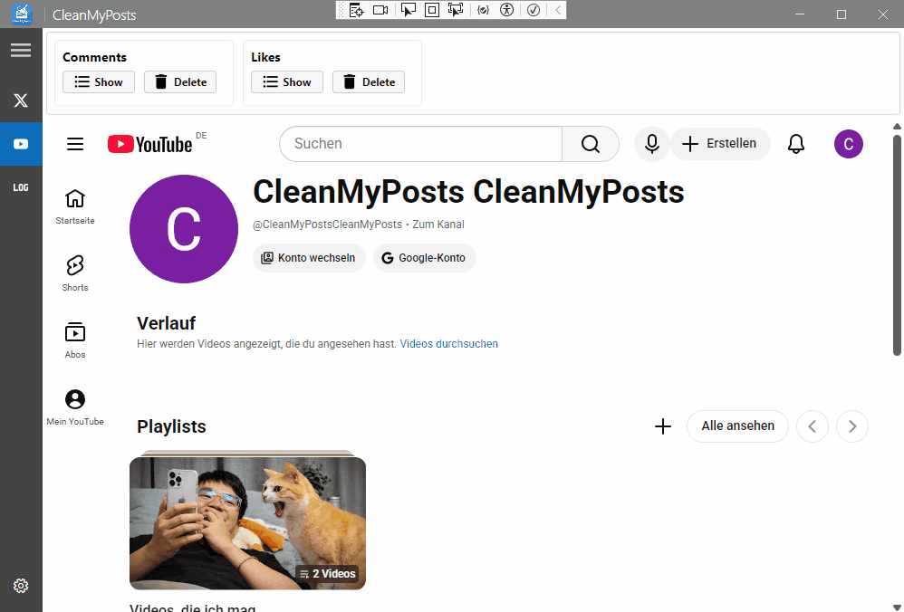
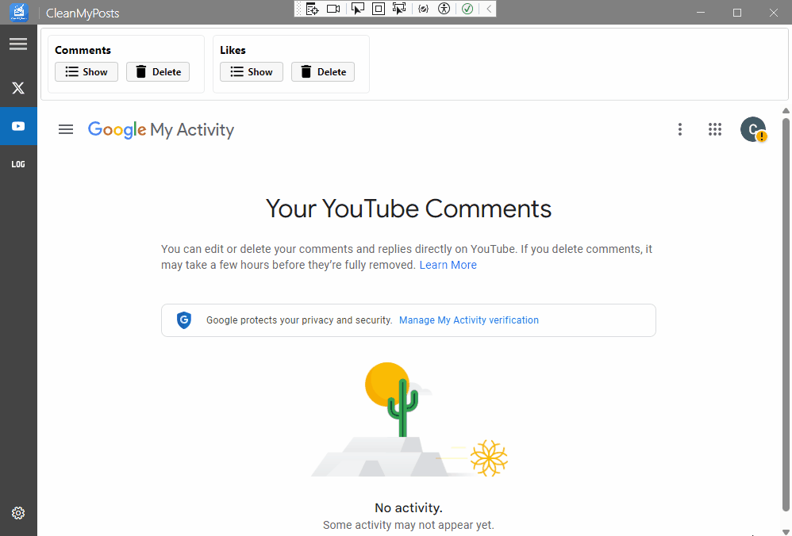
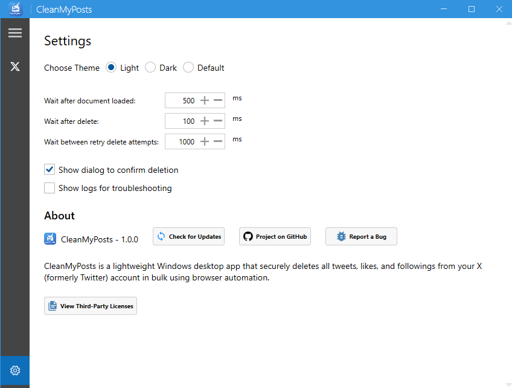

**CleanMyPosts** is a lightweight Windows desktop app that securely deletes all posts, reposts, replies, likes, and followings from your X (formerly Twitter) account, as well as YouTube comments, in bulk using browser automation.

---

## ℹ️ How It Works

**CleanMyPosts** automates the process of cleaning up your social media accounts by interacting with them through an embedded browser. The app sends JavaScript commands to perform actions such as **deleting posts, reposts, replies, likes, unfollowing accounts on X (Twitter)**, and **deleting YouTube comments via Google My Activity**. It retries actions automatically to ensure everything is removed efficiently.

```mermaid
%%{init: {"flowchart": {"diagramPadding": 125}}}%%
flowchart LR
    U["User"]
    A["CleanMyPosts App"]
    B["Embedded Browser"]
    X["X (Twitter)"]
    Y["YouTube"]

    U -->A
    A -->|Retry|B
    A -->|Execute JS Actions|B
    A -->|Refresh page|B
    B -->X
    B -->Y
```

---

## 🚀 Features

### X (Twitter)
- 🔍 **View** all posts, reposts, replies, likes, and followings
- 🗑️ **Bulk delete** all posts
- 🗑️ **Bulk delete** all reposts
- 🗑️ **Bulk delete** all replies
- 🖤 **Remove** all likes
- 👤 **Unfollow** all followings

### YouTube
- 🔍 **View** all your YouTube comments via Google My Activity
- 🗑️ **Bulk delete** all YouTube comments
- 🔍 **View** all liked videos
- 🖤 **Remove** all liked videos

---

## 🛠️ Requirements

- Windows 10 or later  
- X (Twitter) account (for X features)
- Google account (for YouTube features)

---

## 📦 Installation

Once your system meets the requirements, follow these steps to install **CleanMyPosts**:

1. Download the latest version from [Releases](https://github.com/thorstenalpers/x-tweet-cleaner/releases).
2. Run the installer. Ignore the warning about the app being from an unverified publisher.
3. Launch the app and log in with your X (formerly Twitter) or Google account.
4. Start bulk deleting your posts, replies, reposts, likes, following, and YouTube comments easily.

---

## 🎬 See It in Action

### X

  
<strong>Delete posts</strong>

   
  

  
<strong>Delete reposts</strong>

   
  

  
<strong>Delete replies</strong>

   
  

  
<strong>Delete likes</strong>

   
  

  
<strong>Delete Followings</strong>

   
  

### Youtube

  
<strong>Delete Comments</strong>

   
  

  
<strong>Delete Likes</strong>

   
  

### App 

  
<strong>Settings</strong>

   
  

---

## 🧟‍♂️ Advanced: Run Deletion Scripts Manually

You can also run the cleanup directly in your browser using JavaScript snippets:

### 🔧 Steps:

1. Visit your [X profile](https://x.com/) and note your **username** (the part after `x.com/`, without the `@`).
2. Replace all occurrences of `USERNAME` in URLs and function calls with your actual username.
3. Open **Developer Tools** in Chrome by pressing `F12`.
4. Go to the **Sources** tab, then open the **Snippets** panel.
5. Click **"New Snippet"** and paste the JavaScript code from the provided links.
6. Save the snippet.
7. Run the snippet once (right-click → Run) to load the script into the page context.
8. Switch to the **Console** tab.
9. Manually execute the appropriate function call (e.g., `DeleteAllPosts(1000, 1000);`) in the console to start the deletion process.
10. Repeat steps 4–8 for other scripts as needed.

#### Delete Posts  

- URL: [https://x.com/search?q=from%3AUSERNAME](https://x.com/search?q=from%3AUSERNAME)  

- Script: [delete-all-posts.js](https://raw.githubusercontent.com/thorstenalpers/CleanMyPosts/refs/heads/main/src/CleanMyPosts/Scripts/delete-all-posts.js)  

- Run: `DeleteAllPosts(1000, 1000);`

#### Delete Reposts 

- URL: [https://x.com/USERNAME](https://x.com/USERNAME)  

- Script: [delete-all-reposts.js](https://raw.githubusercontent.com/thorstenalpers/CleanMyPosts/refs/heads/main/src/CleanMyPosts/Scripts/delete-all-reposts.js)  

- Run: `DeleteAllRepost(1000);`

#### Delete Replies  

- URL: [https://x.com/USERNAME/with_replies](https://x.com/USERNAME/with_replies)  

- Script: [delete-all-replies.js](https://raw.githubusercontent.com/thorstenalpers/CleanMyPosts/refs/heads/main/src/CleanMyPosts/Scripts/delete-all-replies.js)  

- Run: `DeleteAllReplies('USERNAME', 1000, 5);` // replace **USERNAME** with yours

#### Unlike Posts  

- URL: [https://x.com/USERNAME/likes](https://x.com/USERNAME/likes)  

- Script: [delete-all-likes.js](https://raw.githubusercontent.com/thorstenalpers/CleanMyPosts/refs/heads/main/src/CleanMyPosts/Scripts/delete-all-likes.js)  

- Run: `DeleteAllLike(1000)`

#### Unfollow Accounts  

- URL: [https://x.com/USERNAME/following](https://x.com/USERNAME/following)  

- Script: [delete-all-following.js](https://raw.githubusercontent.com/thorstenalpers/CleanMyPosts/refs/heads/main/src/CleanMyPosts/Scripts/delete-all-following.js)  

- Run: `DeleteAllFollowing(1000, 1000);`

#### Delete YouTube Comments  

- URL: [https://myactivity.google.com/page?hl=en&page=youtube_comments](https://myactivity.google.com/page?hl=en&page=youtube_comments)  

- Script: [delete-all-youtube-posts.js](https://raw.githubusercontent.com/thorstenalpers/CleanMyPosts/refs/heads/main/src/CleanMyPosts/Scripts/delete-all-youtube-posts.js)  

- Run: `DeleteAllYouTubeComments(1000, 500);`

#### Remove Liked Videos  

- URL: [https://www.youtube.com/playlist?list=LL](https://www.youtube.com/playlist?list=LL)  

- Script: [delete-all-youtube-likes.js](https://raw.githubusercontent.com/thorstenalpers/CleanMyPosts/refs/heads/main/src/CleanMyPosts/Scripts/delete-all-youtube-likes.js)  

- Run: `DeleteAllYouTubeLikes(1000, 500);`

> **Note:** Make sure you are logged in to your Google/YouTube account before running these scripts. Default parameters can be omitted: `DeleteAllYouTubeComments();` or `DeleteAllYouTubeLikes();`

---

## 🤝 How to Contribute

We welcome contributions to **CleanMyPosts**! If you’d like to improve the project, please:

1. Check out our [contributing guidelines](CONTRIBUTING.md).
2. Ideally, open an issue before starting work.
3. Submit a pull request with your changes.

Thank you for helping make **CleanMyPosts** better!

---
## ⚠️ Disclaimer

This tool automates actions in a web browser.
Use it at your own risk.
The author is not affiliated with X (formerly Twitter) or Google.

---

## 🐞 Report a Bug

If you encounter any issues or bugs, please [report them here](https://github.com/thorstenalpers/CleanMyPosts/issues).

---

## 🌟 Thank You for Starring!

