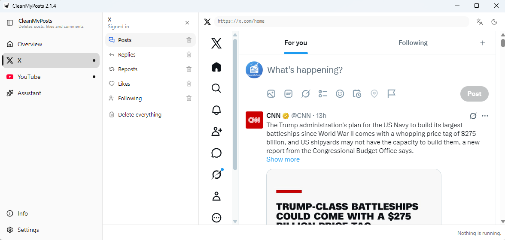

[](https://github.com/thorstenalpers/CleanMyPosts/actions/workflows/ci.yml)
[](https://github.com/thorstenalpers/CleanMyPosts/releases/latest)
[](https://github.com/thorstenalpers/CleanMyPosts/releases)
[](https://github.com/thorstenalpers/CleanMyPosts/releases)
[](https://www.paypal.com/donate/?hosted_button_id=QYHGE9LA9SNAN)
[](https://github.com/thorstenalpers/CleanMyPosts)

**CleanMyPosts** is a lightweight Windows desktop app that securely deletes all posts, reposts, replies, likes, and followings from your X (formerly Twitter) account, as well as YouTube comments, in bulk using browser automation.

🌍 **Speaks your language.** The whole interface is available in **eleven languages** —
English, German, Spanish, French, Hindi, Italian, Japanese, Portuguese, Arabic, Russian and
Chinese — and follows the one Windows runs in unless you pick another. The delete engine is built for it too: it reads the pages structurally
wherever it can and asks every platform for English, so a translated interface on X or
YouTube does not stop a run.

---

## 🚀 Features



### X (Twitter)

- 🔍 **See a list first** — posts, replies, reposts, likes, followings
- 🗑️ **Empty it** — any one of them, on its own
- 💣 **Delete everything** — all five, one after another, from a single button

### YouTube

- 🔍 **See a list first** — comments via Google My Activity, liked videos
- 🗑️ **Empty it** — either one, on its own
- 💣 **Delete everything** — comments and liked videos in one run

Every delete asks for confirmation first, and the confirmation for **Delete everything**
names each list it is about to empty. A finished run reports in the status bar — green when
it worked, amber when it found nothing, red when it failed — and the number of items removed
goes into the log.

**Delete everything** is also on the overview, once for each platform you are signed in to,
so the most common job is one click from the page the app opens on.

### 🔄 Updates

The app looks for a new version when it starts and says so on the overview, with the release
notes of what changed. Nothing is downloaded until you press **Install and restart**, and the
download reports its progress while it runs. The check can be switched off in the settings,
in which case updates are only found when you ask for them on the Info page.

### 🤖 Assistant

X and YouTube change their pages without warning, and when they do, a selector that worked
last week finds nothing. The assistant is the answer to that, and it does three things:

- 🩹 **Repair the engine** — hand it the log of a failed run and it writes a patch for the
  delete logic. You read the patch, and only you decide whether to save it; the app never
  applies one by itself, because that code runs inside your signed-in session.
- 🐞 **File a bug report** — it turns the same log into a report a maintainer can act on,
  and opens GitHub's issue form with the title and body already filled in. Pressing submit
  stays with you.
- 💬 **Ask a question** — about a run, a setting, or what the app just did.

Every mode shows the exact text that would be sent **before** anything is sent, assembled
from the same functions that build the request, so the preview cannot drift from it. Nothing
leaves the machine until you press the button.

It runs against [Claude Code](https://claude.com/claude-code) if it is installed on this
machine, or against a provider of your choice with your own API key — and it can be switched
off entirely in the settings.

<br clear="both" />

---

## 🛠️ Requirements

- Windows 10 version 2004 (build 19041) or later, 64-bit
- X (Twitter) account (for X features)
- Google account (for YouTube features)

Nothing else — the app ships everything it needs and uses the WebView2 runtime that ships
with Windows. The only data it writes is your own preferences and the browser profile that
keeps you signed in, under `%AppData%` and `%LocalAppData%`.

---

## 📦 Installation

Once your system meets the requirements, follow these steps to install **CleanMyPosts**:

1. Download the latest version from [Releases](https://github.com/thorstenalpers/CleanMyPosts/releases).
2. Run the installer. Ignore the warning about the app being from an unverified publisher.
3. Launch the app and log in with your X (formerly Twitter) or Google account.
4. Start bulk deleting your posts, replies, reposts, likes, following, and YouTube comments easily.

---

## 🎬 See It in Action

**Overview** — where you land. Which accounts are signed in, what each platform has to clean,
and **Delete everything** for every platform you are signed in to. A waiting update is
announced here too, with its release notes.


**X (Twitter)** — **Delete everything** running: posts, replies, reposts, likes and
followings, one list after the next. The sub-navigation stays open the whole time, so the
controls do not disappear mid-task.

▶️ [Watch the run (MP4)](./assets/X.mp4)

**YouTube** — comments and liked videos in a single run, each with its own status.

▶️ [Watch the run (MP4)](./assets/Youtube.mp4)

**Assistant** — the exact text that would be sent, shown before anything is sent.


---

## ℹ️ How It Works

There is **no API, no OAuth, and no token**. You sign in exactly as you would in a browser,
and the app clicks the same buttons you would — just without stopping. Deletions are
deliberately paced; the waits between them are configurable and exist to keep the platforms
from treating you as a bot.

### Why a browser and not an API?

Because neither platform will sell you the thing you actually want, and one of them will
charge you for the detour.

**Bulk deletion is not offered.** Not on X, not on YouTube. Their interfaces delete one item
at a time, each behind its own menu and its own confirmation — which is fine for a mistake
and hopeless for ten years of posting.

**The programmatic route costs.** X keeps API access behind paid tiers, so deleting your own
posts through it means paying a monthly fee for the privilege. YouTube's Data API is free but
metered: every deletion spends from a daily quota that runs out long before a busy account is
clean, and a large clean-up turns into a job spread over days.

**Driving the browser costs nothing.** The app opens the same pages you would, in your own
signed-in session, and presses the same buttons. No developer account, no key, no monthly
fee, no quota — and nothing about you leaves the machine, because there is no server of ours
for it to leave to.

---

## 🩺 Troubleshooting

Most runs that go wrong go wrong in one of a few ways. The app's own log is the first place
to look — **Log** in the sidebar, or ask the built-in assistant, which is handed this same
list along with your log.

| Symptom                                                                                 | Why                                                                                                                                    | What to do                                                                                                                                                                                                              |
| --------------------------------------------------------------------------------------- | -------------------------------------------------------------------------------------------------------------------------------------- | ----------------------------------------------------------------------------------------------------------------------------------------------------------------------------------------------------------------------- |
| Nothing is deleted, and the log ends with _"No scroll change; assuming no more posts."_ | The page had nothing to act on: you are signed out, or the profile shown is not yours.                                                 | Check the dot next to the platform in the sidebar. If it is dim, sign in inside the app's browser pane and start the action again.                                                                                      |
| A run deletes a handful of items and then stops                                         | The platform is throttling the session — it has decided the clicking looks automated.                                                  | Raise **Settings → Timing**: _between deletions_ to 1500 ms or more, _after a page loads_ to 5000 ms. Then wait a few minutes before the next run. Lower values are what get a session flagged.                         |
| The browser pane stays blank or white                                                   | The WebView2 runtime is missing, or the platform answered with an interstitial (consent, captcha, re-login).                           | Install the [Evergreen WebView2 runtime](https://developer.microsoft.com/microsoft-edge/webview2/) and restart. If it is an interstitial, click through it once by hand — the session is yours, the app only drives it. |
| A cookie banner sits over everything                                                    | The app clicks consent banners away by itself, preferring the _reject_ button, but a wording it has never seen gets through.           | Dismiss it once by hand; the choice is stored in the same browser profile and does not come back. Please report the wording so it can be added.                                                                         |
| _"Deletion failed."_ immediately, on every item                                         | The platform changed its markup, so the buttons the engine looks for are no longer where they were.                                    | Update to the [latest release](https://github.com/thorstenalpers/CleanMyPosts/releases/latest) first. If that does not fix it, this is a real bug — report it with the log.                                             |
| Some likes or followings survive several runs                                           | Not everything is reachable from the list: protected accounts, items behind _Show more_, and posts that were already gone server-side. | Run the action once more. What is left after two clean runs belongs in a bug report.                                                                                                                                    |
| YouTube comments cannot be reached                                                      | My Activity asks for the Google sign-in again, per session.                                                                            | Open the YouTube pane, sign in, and start the action again.                                                                                                                                                             |
| The assistant says no source is set up                                                  | Neither Claude Code nor a provider key was found.                                                                                      | **Settings → Assistant**: point it at `claude.exe`, or store an API key. Nothing is sent anywhere until one of the two exists.                                                                                          |
| _Check for updates_ reports nothing                                                     | Updates only work in the installed build, and the check needs network access.                                                          | Compare your version on the **Info** page with the [latest release](https://github.com/thorstenalpers/CleanMyPosts/releases/latest) and install it manually if they differ.                                             |

Deletions cannot be undone, and no run is ever resumed from a copy of your data — there is
no copy. If something was removed that should not have been, it is gone on the platform's
side too.

---

## 🧑‍💻 Building from Source

Requires the [Rust toolchain](https://rustup.rs/) and [Node.js 24+](https://nodejs.org/).

```bash
npm ci
npm run build
npm run start
```

`npm run build` before the first `npm run start` is not optional. The Rust crate compiles
the delete engine into itself with `include_str!("../../dist/content/content.js")`, and
`npm run start` does not produce that file — it runs Vite's dev server, which serves the
interface and nothing else. Without the build the crate does not compile at all. The same
applies after any change under `src/lib/engine/`: the app keeps running the bundle it was
compiled with until it is rebuilt.

`npm run start` then opens the real Tauri window, with hot reload for the interface.

Build the installer:

```bash
npm run app:build
```

Working on the UI alone is faster in the browser — it falls back to an in-memory mock host,
so no WebView2 is needed:

```bash
npm run dev
```

Checks and tests:

```bash
npm run lint
npm run check
npm run test
npm run test:e2e
cargo test --manifest-path src-tauri/Cargo.toml --lib
```

`npm test` covers the interface and the engine; the Rust half has no npm script and is the
line above. `npm run test:e2e` builds the engine bundle first and runs it in real Chromium
against saved page markup — never against the live sites, so nothing is deleted for real.

The architecture, the UI↔host bridge, and the design rules are documented under
[`.agents/docs/`](.agents/docs/) — start at [AGENTS.md](AGENTS.md).

---

## 🤝 How to Contribute

We welcome contributions to **CleanMyPosts**! If you’d like to improve the project, please:

1. Check out our [contributing guidelines](CONTRIBUTING.md).
2. Ideally, open an issue before starting work.
3. Submit a pull request with your changes.

Thank you for helping make **CleanMyPosts** better!

---

## ⚠️ Disclaimer

This tool automates a web browser to delete your own content. It uses no API and no token —
it presses the same buttons you would, in your own signed-in session.

**Deletions are permanent.** Nothing here can undo them, and neither platform offers a way
back. Look at a list before you empty it.

**Automation may conflict with the platforms' terms of use.** They restrict automated
access, and the consequence would fall on your account rather than on this software. You use
it at your own risk.

The author is not affiliated with X (formerly Twitter) or Google. Provided as-is under the
MIT licence, without warranty of any kind.

---

## 🐞 Report a Bug

If you encounter any issues or bugs, please [report them here](https://github.com/thorstenalpers/CleanMyPosts/issues).
