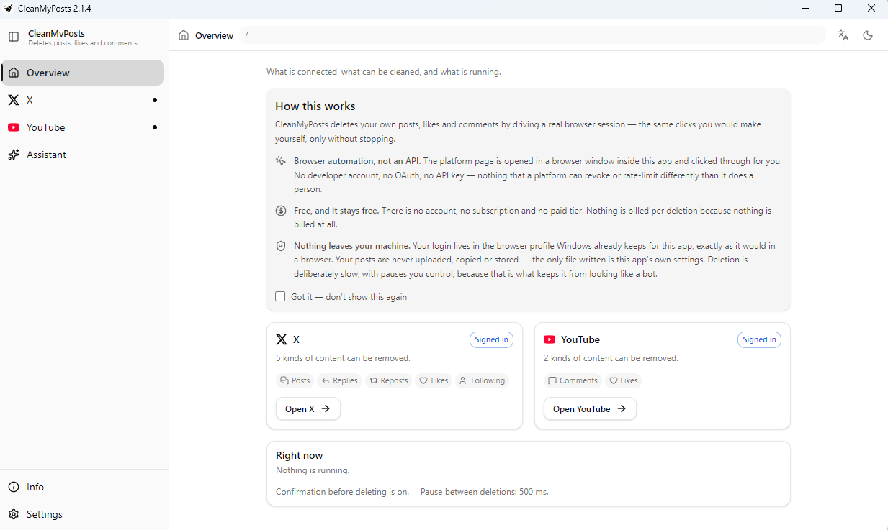
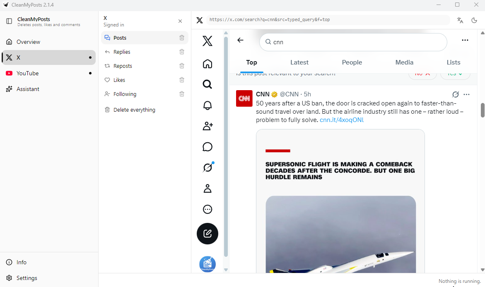
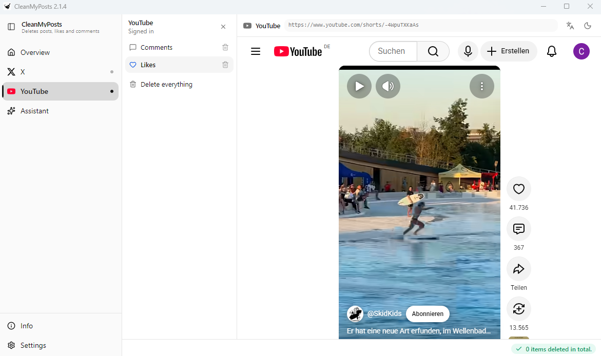
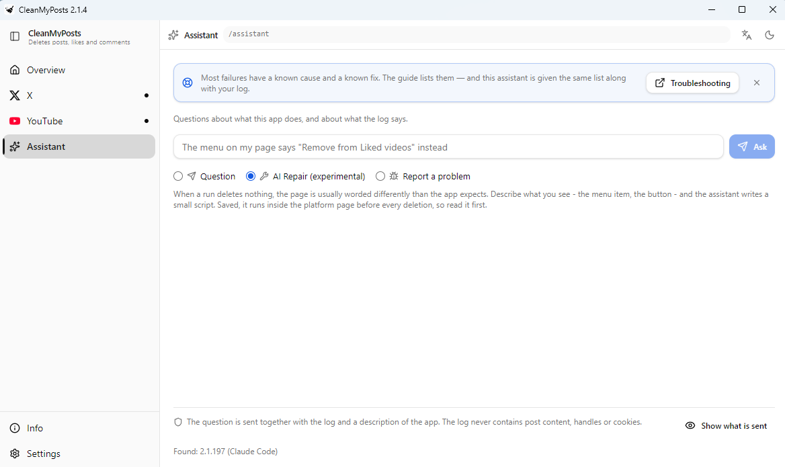

[](https://github.com/thorstenalpers/CleanMyPosts/actions/workflows/ci.yml)
[](https://github.com/thorstenalpers/CleanMyPosts/releases/latest)
[](https://github.com/thorstenalpers/CleanMyPosts/releases)
[](https://github.com/thorstenalpers/CleanMyPosts/releases)
[](https://www.paypal.com/donate/?hosted_button_id=QYHGE9LA9SNAN)
[](https://github.com/thorstenalpers/CleanMyPosts)

**CleanMyPosts** is a lightweight Windows desktop app that securely deletes all posts, reposts, replies, likes, and followings from your X (formerly Twitter) account, as well as YouTube comments, in bulk using browser automation.

---

## ℹ️ How It Works

**CleanMyPosts** automates the process of cleaning up your social media accounts by interacting with them through an embedded browser. The app sends JavaScript commands to perform actions such as **deleting posts, reposts, replies, likes, unfollowing accounts on X (Twitter)**, and **deleting YouTube comments via Google My Activity**. It retries actions automatically to ensure everything is removed efficiently.

There is **no API, no OAuth, and no token**. You sign in exactly as you would in a browser,
and the app clicks the same buttons you would — just without stopping. Deletions are
deliberately paced; the waits between them are configurable and exist to keep the platforms
from treating you as a bot.

---

## 🚀 Features

### X (Twitter)

- 🔍 **View** all posts, reposts, replies, likes, and followings
- 🗑️ **Bulk delete** all posts
- 🗑️ **Bulk delete** all reposts
- 🗑️ **Bulk delete** all replies
- 🖤 **Remove** all likes
- 👤 **Unfollow** all followings
- 💣 **Delete everything** — every list above, one after another, from a single button

### YouTube

- 🔍 **View** all your YouTube comments via Google My Activity
- 🗑️ **Bulk delete** all YouTube comments
- 🔍 **View** all liked videos
- 🖤 **Remove** all liked videos
- 💣 **Delete everything** — comments and liked videos in one run

Every delete asks for confirmation first, and the confirmation for **Delete everything**
names each list it is about to empty. A finished run reports in the status bar — green when
it worked, amber when it found nothing, red when it failed — and the number of items removed
goes into the log.

---

## 🛠️ Requirements

- Windows 10 version 2004 (build 19041) or later, 64-bit
- X (Twitter) account (for X features)
- Google account (for YouTube features)

Nothing else — the app ships everything it needs and uses the WebView2 runtime that ships
with Windows. The only data it writes is your own preferences and the browser profile that
keeps you signed in, under `%AppData%` and `%LocalAppData%`.

---

## 📦 Installation

Once your system meets the requirements, follow these steps to install **CleanMyPosts**:

1. Download the latest version from [Releases](https://github.com/thorstenalpers/CleanMyPosts/releases).
2. Run the installer. Ignore the warning about the app being from an unverified publisher.
3. Launch the app and log in with your X (formerly Twitter) or Google account.
4. Start bulk deleting your posts, replies, reposts, likes, following, and YouTube comments easily.

---

## 🎬 See It in Action

Each platform gets its own header, sub-navigation and status bar. The sub-navigation stays
open while a run is going, so the controls do not disappear mid-task.

<details>
  <summary><strong>Overview</strong></summary>
  <br/>
  
</details>

<details>
  <summary><strong>X (Twitter)</strong></summary>
  <br/>
  
</details>

<details>
  <summary><strong>YouTube</strong></summary>
  <br/>
  
</details>

<details>
  <summary><strong>Assistant</strong></summary>
  <br/>
  
</details>

---

## 🧟‍♂️ Advanced: Run the Deletion Engine Manually

The same code the app injects can be run by hand in any Chromium browser's DevTools
console — useful on non-Windows machines, or to debug a selector against the live site.

The deletion logic lives in [`src/lib/engine/`](src/lib/engine) — the actions in
[`x/`](src/lib/engine/x) and [`youtube/`](src/lib/engine/youtube), every selector in
[`config.ts`](src/lib/engine/config.ts), and the shared clicking and logging in
[`dom.ts`](src/lib/engine/dom.ts). [`src/content-entry.ts`](src/content-entry.ts) is the
bundle's entry point; the result is a single dependency-free IIFE exposing `window.__cmp`.

### 🔧 Build the bundle

Requires [Node.js](https://nodejs.org/) 24+, the version CI builds with:

```bash
npm ci && npm run build
```

The result is `dist/content/content.js`. That file is what the Windows app compiles into
itself, so a change to the engine only reaches the app once this has been rebuilt.

### 🔧 Run it

1. Log in and open the page for the action you want (see the table below), replacing
   `USERNAME` with your X handle — the part after `x.com/`, without the `@`.
2. Open **DevTools** (`F12`) and switch to the **Console** tab.
3. Optional — the engine reports progress through the WebView2 host channel, which
   does not exist in a normal browser, so nothing is printed unless you shim it first:
   ```js
   window.chrome = { ...window.chrome, webview: { postMessage: (m) => console.log(m) } };
   ```
4. Paste the entire contents of `content.js` and press Enter. This only defines
   `window.__cmp`; nothing is deleted yet.
5. Start the run:
   ```js
   __cmp.run(
   	'x',
   	'deletePosts',
   	JSON.stringify({
   		requestId: 'manual',
   		userName: 'USERNAME',
   		waitAfterDelete: 1000,
   		waitBetweenRetryDeleteAttempts: 1000
   	})
   );
   ```

`__cmp.run` returns immediately and works through the page in the background; it stops
on its own once nothing deletable is left. `__cmp.isEmpty('x', 'deletePosts')` reports
whether the current page still has anything to delete.

There is no `deleteAll` here. The app's **Delete everything** button is the app running the
actions in the table below one after another, navigating to each page in turn — by hand, do
the same thing in the same order.

| Platform  | Action            | Open this page first                                                                             |
| --------- | ----------------- | ------------------------------------------------------------------------------------------------ |
| `x`       | `deletePosts`     | [`x.com/search?q=from:USERNAME`](https://x.com/search?q=from%3AUSERNAME&src=typed_query)         |
| `x`       | `deleteReplies`   | [`x.com/USERNAME/with_replies`](https://x.com/)                                                  |
| `x`       | `deleteReposts`   | [`x.com/USERNAME`](https://x.com/)                                                               |
| `x`       | `deleteLikes`     | [`x.com/USERNAME/likes`](https://x.com/)                                                         |
| `x`       | `deleteFollowing` | [`x.com/USERNAME/following`](https://x.com/)                                                     |
| `youtube` | `deleteComments`  | [My Activity → YouTube comments](https://myactivity.google.com/page?hl=en&page=youtube_comments) |
| `youtube` | `deleteLikes`     | [Liked videos playlist](https://www.youtube.com/playlist?list=LL)                                |

> **Note:** `deletePosts` and `deleteReplies` need your handle in `userName`, and refuse to
> open any menu without it. On a page that also shows other people's posts — a repost, or the
> post a reply answers — the engine has to know which article is yours: opening a stranger's
> menu finds "Report post" and no delete entry at all. The app passes the handle on every run;
> by hand it has to be in the JSON.

> **Note:** Make sure you are logged in to the relevant account before starting a run.

> **Note:** The app asks both platforms for these pages in English (`lang=en`, `hl=en`),
> because the engine finds some entries by their wording. Neither platform is obliged to
> honour it — an account with its own language setting wins — so those lookups match several
> languages. Opening a page by hand simply skips the request, which is worth knowing when a
> run behaves differently in the browser than in the app.

---

## 🩺 Troubleshooting

Most runs that go wrong go wrong in one of a few ways. The app's own log is the first place
to look — **Log** in the sidebar, or ask the built-in assistant, which is handed this same
list along with your log.

| Symptom                                                                                 | Why                                                                                                                                    | What to do                                                                                                                                                                                                              |
| --------------------------------------------------------------------------------------- | -------------------------------------------------------------------------------------------------------------------------------------- | ----------------------------------------------------------------------------------------------------------------------------------------------------------------------------------------------------------------------- |
| Nothing is deleted, and the log ends with _"No scroll change; assuming no more posts."_ | The page had nothing to act on: you are signed out, or the profile shown is not yours.                                                 | Check the dot next to the platform in the sidebar. If it is dim, sign in inside the app's browser pane and start the action again.                                                                                      |
| A run deletes a handful of items and then stops                                         | The platform is throttling the session — it has decided the clicking looks automated.                                                  | Raise **Settings → Timing**: _between deletions_ to 1500 ms or more, _after a page loads_ to 5000 ms. Then wait a few minutes before the next run. Lower values are what get a session flagged.                         |
| The browser pane stays blank or white                                                   | The WebView2 runtime is missing, or the platform answered with an interstitial (consent, captcha, re-login).                           | Install the [Evergreen WebView2 runtime](https://developer.microsoft.com/microsoft-edge/webview2/) and restart. If it is an interstitial, click through it once by hand — the session is yours, the app only drives it. |
| A cookie banner sits over everything                                                    | The app clicks consent banners away by itself, preferring the _reject_ button, but a wording it has never seen gets through.           | Dismiss it once by hand; the choice is stored in the same browser profile and does not come back. Please report the wording so it can be added.                                                                         |
| _"Deletion failed."_ immediately, on every item                                         | The platform changed its markup, so the buttons the engine looks for are no longer where they were.                                    | Update to the [latest release](https://github.com/thorstenalpers/CleanMyPosts/releases/latest) first. If that does not fix it, this is a real bug — report it with the log.                                             |
| Some likes or followings survive several runs                                           | Not everything is reachable from the list: protected accounts, items behind _Show more_, and posts that were already gone server-side. | Run the action once more. What is left after two clean runs belongs in a bug report.                                                                                                                                    |
| YouTube comments cannot be reached                                                      | My Activity asks for the Google sign-in again, per session.                                                                            | Open the YouTube pane, sign in, and start the action again.                                                                                                                                                             |
| The assistant says no source is set up                                                  | Neither Claude Code nor a provider key was found.                                                                                      | **Settings → Assistant**: point it at `claude.exe`, or store an API key. Nothing is sent anywhere until one of the two exists.                                                                                          |
| _Check for updates_ reports nothing                                                     | Updates only work in the installed build, and the check needs network access.                                                          | Compare your version on the **Info** page with the [latest release](https://github.com/thorstenalpers/CleanMyPosts/releases/latest) and install it manually if they differ.                                             |

Deletions cannot be undone, and no run is ever resumed from a copy of your data — there is
no copy. If something was removed that should not have been, it is gone on the platform's
side too.

---

## 🧑‍💻 Building from Source

Requires the [Rust toolchain](https://rustup.rs/) and [Node.js 24+](https://nodejs.org/).

```bash
npm ci
npm run build
npm run start
```

`npm run build` before the first `npm run start` is not optional. The Rust crate compiles
the delete engine into itself with `include_str!("../../dist/content/content.js")`, and
`npm run start` does not produce that file — it runs Vite's dev server, which serves the
interface and nothing else. Without the build the crate does not compile at all. The same
applies after any change under `src/lib/engine/`: the app keeps running the bundle it was
compiled with until it is rebuilt.

`npm run start` then opens the real Tauri window, with hot reload for the interface.

Build the installer:

```bash
npm run app:build
```

Working on the UI alone is faster in the browser — it falls back to an in-memory mock host,
so no WebView2 is needed:

```bash
npm run dev
```

Checks and tests:

```bash
npm run lint
npm run check
npm run test
npm run test:e2e
cargo test --manifest-path src-tauri/Cargo.toml --lib
```

`npm test` covers the interface and the engine; the Rust half has no npm script and is the
line above. `npm run test:e2e` builds the engine bundle first and runs it in real Chromium
against saved page markup — never against the live sites, so nothing is deleted for real.

The architecture, the UI↔host bridge, and the design rules are documented under
[`.agents/docs/`](.agents/docs/) — start at [AGENTS.md](AGENTS.md).

---

## 🤝 How to Contribute

We welcome contributions to **CleanMyPosts**! If you’d like to improve the project, please:

1. Check out our [contributing guidelines](CONTRIBUTING.md).
2. Ideally, open an issue before starting work.
3. Submit a pull request with your changes.

Thank you for helping make **CleanMyPosts** better!

---

## ⚠️ Disclaimer

This tool automates actions in a web browser.
Use it at your own risk.
The author is not affiliated with X (formerly Twitter) or Google.

---

## 🐞 Report a Bug

If you encounter any issues or bugs, please [report them here](https://github.com/thorstenalpers/CleanMyPosts/issues).

---

## 🌟 Thank You for Starring!

[](https://www.star-history.com/#thorstenalpers/CleanMyPosts&type=date&legend=top-left)
