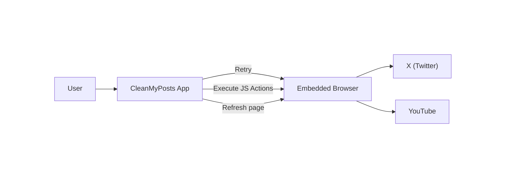
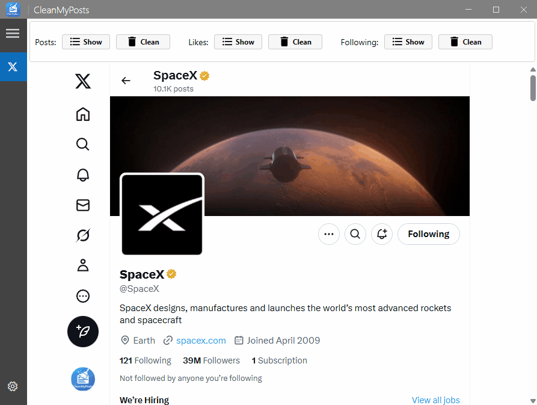
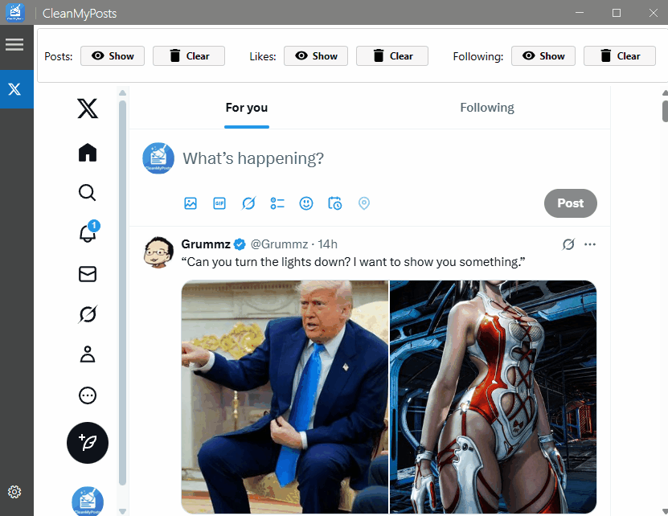
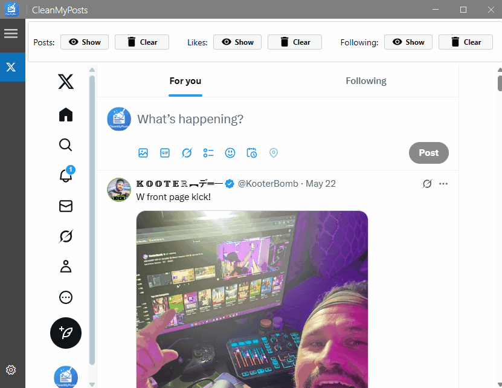
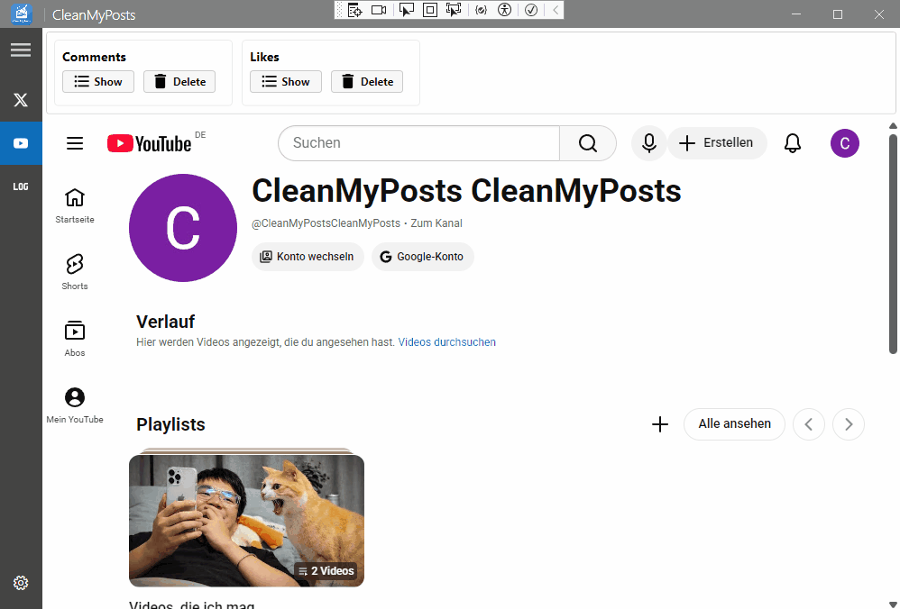
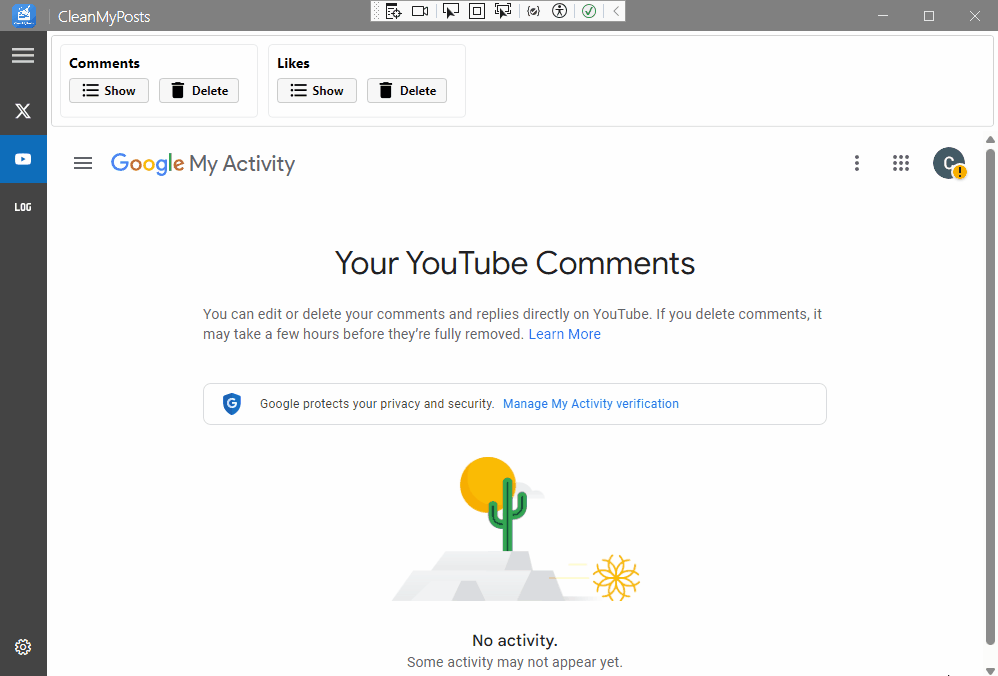
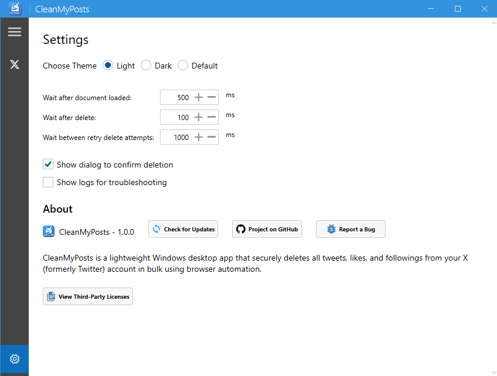

[](https://github.com/thorstenalpers/CleanMyPosts/actions/workflows/ci.yml)
[](https://github.com/thorstenalpers/CleanMyPosts/releases/latest)
[](https://github.com/thorstenalpers/CleanMyPosts/releases)
[](https://github.com/thorstenalpers/CleanMyPosts/releases)
[](https://www.paypal.com/donate/?hosted_button_id=QYHGE9LA9SNAN)
[](https://github.com/thorstenalpers/CleanMyPosts)

**CleanMyPosts** is a lightweight Windows desktop app that securely deletes all posts, reposts, replies, likes, and followings from your X (formerly Twitter) account, as well as YouTube comments, in bulk using browser automation.

---

## ℹ️ How It Works

**CleanMyPosts** automates the process of cleaning up your social media accounts by interacting with them through an embedded browser. The app sends JavaScript commands to perform actions such as **deleting posts, reposts, replies, likes, unfollowing accounts on X (Twitter)**, and **deleting YouTube comments via Google My Activity**. It retries actions automatically to ensure everything is removed efficiently.

There is **no API, no OAuth, and no token**. You sign in exactly as you would in a browser,
and the app clicks the same buttons you would — just without stopping. Deletions are
deliberately paced; the waits between them are configurable and exist to keep the platforms
from treating you as a bot.



```mermaid
%%{init: {"flowchart": {"diagramPadding": 125}}}%%
flowchart LR
    U["User"]
    A["CleanMyPosts App"]
    B["Embedded Browser"]
    X["X (Twitter)"]
    Y["YouTube"]

    U -->A
    A -->|Retry|B
    A -->|Execute JS Actions|B
    A -->|Refresh page|B
    B -->X
    B -->Y
```

---

## 🚀 Features

### X (Twitter)
- 🔍 **View** all posts, reposts, replies, likes, and followings
- 🗑️ **Bulk delete** all posts
- 🗑️ **Bulk delete** all reposts
- 🗑️ **Bulk delete** all replies
- 🖤 **Remove** all likes
- 👤 **Unfollow** all followings

### YouTube
- 🔍 **View** all your YouTube comments via Google My Activity
- 🗑️ **Bulk delete** all YouTube comments
- 🔍 **View** all liked videos
- 🖤 **Remove** all liked videos

---


## 🛠️ Requirements

- Windows 10 version 2004 (build 19041) or later, 64-bit
- X (Twitter) account (for X features)
- Google account (for YouTube features)

Nothing else — the app ships everything it needs and uses the WebView2 runtime that ships
with Windows. The only data it writes is your own preferences and the browser profile that
keeps you signed in, under `%AppData%` and `%LocalAppData%`.

---

## 📦 Installation

Once your system meets the requirements, follow these steps to install **CleanMyPosts**:

1. Download the latest version from [Releases](https://github.com/thorstenalpers/x-tweet-cleaner/releases).
2. Run the installer. Ignore the warning about the app being from an unverified publisher.
3. Launch the app and log in with your X (formerly Twitter) or Google account.
4. Start bulk deleting your posts, replies, reposts, likes, following, and YouTube comments easily.

---

## 🎬 See It in Action


### X

<details>
  <summary><strong>Delete posts</strong></summary>
  <br/>
  
</details>

<details>
  <summary><strong>Delete reposts</strong></summary>
  <br/>
  
</details>

<details>
  <summary><strong>Delete replies</strong></summary>
  <br/>
  
</details>

<details>
  <summary><strong>Delete likes</strong></summary>
  <br/>
  
</details>

<details>
  <summary><strong>Delete Followings</strong></summary>
  <br/>
  
</details>

### Youtube

<details>
  <summary><strong>Delete Comments</strong></summary>
  <br/>
  
</details>

<details>
  <summary><strong>Delete Likes</strong></summary>
  <br/>
  
</details>

### App 

<details>
  <summary><strong>Settings</strong></summary>
  <br/>
  
</details>

---


## 🧟‍♂️ Advanced: Run the Deletion Engine Manually

The same code the app injects can be run by hand in any Chromium browser's DevTools
console — useful on non-Windows machines, or to debug a selector against the live site.

The deletion logic lives in [`src/lib/engine/`](src/lib/engine)
([X actions](src/lib/engine/x), [YouTube actions](src/lib/engine/youtube))
and is bundled into a single dependency-free IIFE that exposes `window.__cmp`.

### 🔧 Build the bundle

Requires [Node.js](https://nodejs.org/) 20+:

```bash
npm ci && npm run build:content
```

The result is `dist/content/content.js`.

### 🔧 Run it

1. Log in and open the page for the action you want (see the table below), replacing
   `USERNAME` with your X handle — the part after `x.com/`, without the `@`.
2. Open **DevTools** (`F12`) and switch to the **Console** tab.
3. Optional — the engine reports progress through the WebView2 host channel, which
   does not exist in a normal browser, so nothing is printed unless you shim it first:
   ```js
   window.chrome = { ...window.chrome, webview: { postMessage: (m) => console.log(m) } };
   ```
4. Paste the entire contents of `content.js` and press Enter. This only defines
   `window.__cmp`; nothing is deleted yet.
5. Start the run:
   ```js
   __cmp.run('x', 'deletePosts', JSON.stringify({
     requestId: 'manual',
     waitAfterDelete: 1000,
     waitBetweenRetryDeleteAttempts: 1000
   }));
   ```

`__cmp.run` returns immediately and works through the page in the background; it stops
on its own once nothing deletable is left. `__cmp.isEmpty('x', 'deletePosts')` reports
whether the current page still has anything to delete.

| Platform | Action | Open this page first |
| --- | --- | --- |
| `x` | `deletePosts` | [`x.com/search?q=from:USERNAME`](https://x.com/search?q=from%3AUSERNAME&src=typed_query) |
| `x` | `deleteReplies` | [`x.com/USERNAME/with_replies`](https://x.com/) |
| `x` | `deleteReposts` | [`x.com/USERNAME`](https://x.com/) |
| `x` | `deleteLikes` | [`x.com/USERNAME/likes`](https://x.com/) |
| `x` | `deleteFollowing` | [`x.com/USERNAME/following`](https://x.com/) |
| `youtube` | `deleteComments` | [My Activity → YouTube comments](https://myactivity.google.com/page?hl=en&page=youtube_comments) |
| `youtube` | `deleteLikes` | [Liked videos playlist](https://www.youtube.com/playlist?list=LL) |

> **Note:** `deleteReplies` additionally needs your handle, since it has to tell your own
> replies apart from the posts they answer — add `userName: 'USERNAME'` to the JSON.

> **Note:** Make sure you are logged in to the relevant account before starting a run.

---

## 🧑‍💻 Building from Source

Requires the [Rust toolchain](https://rustup.rs/) and [Node.js 22+](https://nodejs.org/).
The Tauri build runs the Svelte build for you, so this is enough for a runnable app:

```bash
npm ci && npx tauri build
```

Working on the UI alone is faster in the browser — it falls back to an in-memory mock host,
so no WebView2 is needed:

```bash
npm run dev
```

Tests:

```bash
npm run check
npm run test
npm run test:e2e
cargo test --manifest-path src-tauri/Cargo.toml
```

The architecture, the UI↔host bridge, and the design rules are documented under
[`.agents/docs/`](.agents/docs/) — start at [AGENTS.md](AGENTS.md).

---

## 🤝 How to Contribute

We welcome contributions to **CleanMyPosts**! If you’d like to improve the project, please:

1. Check out our [contributing guidelines](CONTRIBUTING.md).
2. Ideally, open an issue before starting work.
3. Submit a pull request with your changes.

Thank you for helping make **CleanMyPosts** better!


---
## ⚠️ Disclaimer

This tool automates actions in a web browser.
Use it at your own risk.
The author is not affiliated with X (formerly Twitter) or Google.

---

## 🐞 Report a Bug

If you encounter any issues or bugs, please [report them here](https://github.com/thorstenalpers/CleanMyPosts/issues).

---


## 🌟 Thank You for Starring!


[](https://www.star-history.com/#thorstenalpers/CleanMyPosts&type=date&legend=top-left)
