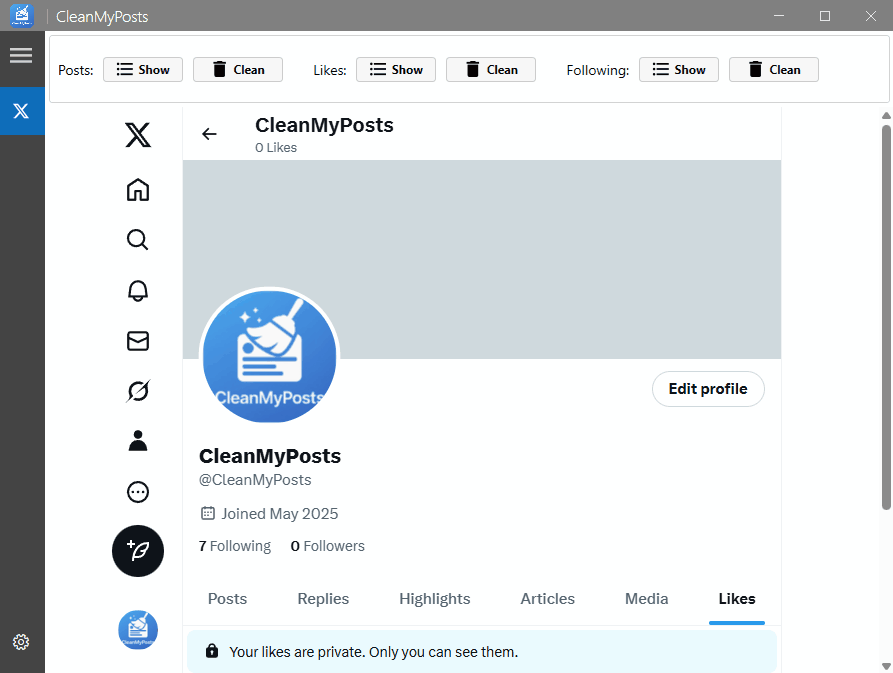

**CleanMyPosts** is a lightweight Windows desktop app that securely deletes all posts, reposts, replies, likes, and followings from your X (formerly Twitter) account in bulk using browser automation.

---

## 🚀 Features

- Bulk delete **all posts**  
- Bulk delete **all reposts**  
- Bulk delete **all replies**  
- Remove **all likes** with a single click  
- Unfollow **all accounts** at once  
- Secure browser automation  

---

## 🛠️ Requirements

- Windows 10 or later  
- X (Twitter) account  

---

## 📦 Installation

1. Download the latest version from [Releases](https://github.com/thorstenalpers/x-tweet-cleaner/releases).
2. Run the installer. Ignore the warning about the app being from an unverified publisher.
3. Launch the app and log in with your X (formerly Twitter) account.
4. Start bulk deleting your posts, replies, reposts, likes, and following easily.

---

## 🎬 See It in Action

  
<strong>Delete posts</strong>

   
  

  
<strong>Delete reposts</strong>

   
  

  
<strong>Delete replies</strong>

   
  

  
<strong>Delete likes</strong>

   
  

  
<strong>Delete Followings</strong>

   
  

  
<strong>Settings</strong>

   
  

---

## 🧟‍♂️ Advanced: Run Deletion Scripts Manually

You can also run the cleanup directly in your browser using JavaScript snippets:

### 🔧 Steps:

1. Visit your [X profile](https://x.com/) and note your **username** (e.g., `@USERNAME`).
2. Open **Developer Tools** in Chrome by pressing `F12`.
3. Go to the **Sources** tab, then open the **Snippets** panel.
4. Click **"New Snippet"** and paste the JavaScript code from the provided links.
5. Save the snippet.
6. Run the snippet once by right-clicking it and selecting **Run** — this loads the script into the page context.
7. Switch to the **Console** tab.
8. Manually execute the appropriate function call (e.g., `DeleteAllPosts(1000, 1000);`) in the console to start the deletion process.
9. Repeat step 4 with other functions as needed.

#### Delete Posts  
- URL: [https://x.com/search?q=from%3AUSERNAME](https://x.com/search?q=from%3AUSERNAME)  
- Script: [delete-all-posts.js](https://raw.githubusercontent.com/thorstenalpers/CleanMyPosts/refs/heads/main/src/UI/Scripts/delete-all-posts.js)  
- Run: `DeleteAllPosts(1000, 1000);`

#### Delete Reposts  
- URL: [https://x.com/USERNAME](https://x.com/USERNAME)  
- Script: [delete-all-reposts.js](https://raw.githubusercontent.com/thorstenalpers/CleanMyPosts/refs/heads/main/src/UI/Scripts/delete-all-reposts.js)  
- Run: `DeleteAllRepost(1000);`

#### Delete Replies  
- URL: [https://x.com/USERNAME/with_replies](https://x.com/USERNAME/with_replies)  
- Script: [delete-all-replies.js](https://raw.githubusercontent.com/thorstenalpers/CleanMyPosts/refs/heads/main/src/UI/Scripts/delete-all-replies.js)  
- Run: `DeleteAllReplies('USERNAME', 1000, 5);` // replace USERNAME with yours

#### Unlike Posts  
- URL: [https://x.com/USERNAME/likes](https://x.com/USERNAME/likes)  
- Script: [delete-all-likes.js](https://raw.githubusercontent.com/thorstenalpers/CleanMyPosts/refs/heads/main/src/UI/Scripts/delete-all-likes.js)  
- Run: `DeleteAllLike(1000)`

#### Unfollow Accounts  
- URL: [https://x.com/USERNAME/following](https://x.com/USERNAME/following)  
- Script: [delete-all-following.js](https://raw.githubusercontent.com/thorstenalpers/CleanMyPosts/refs/heads/main/src/UI/Scripts/delete-all-following.js)  
- Run: `DeleteAllFollowing(1000, 1000);`

---

## 🤝 How to Contribute

We welcome contributions to CleanMyPosts! If you’d like to improve the project, please:

1. Check out our [contributing guidelines](CONTRIBUTING.md).
2. Ideally, open an issue before starting work.
3. Submit a pull request with your changes.

Thank you for helping make CleanMyPosts better!

---

## 🐞 Report a Bug

If you encounter any issues or bugs, please [report them here](https://github.com/thorstenalpers/CleanMyPosts/issues).
