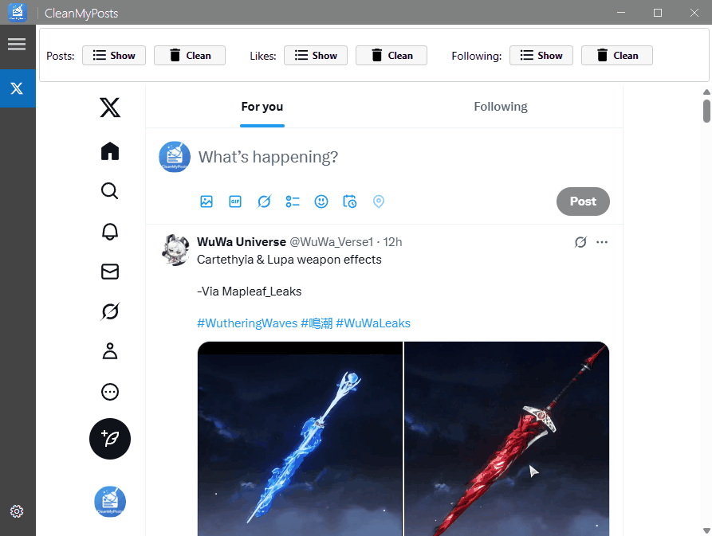

**CleanMyPosts** is a lightweight Windows desktop app that securely deletes all posts, reposts, replies, likes, and followings from your X (formerly Twitter) account in bulk using browser automation.

## 🚀 Features

- Bulk delete **all posts**  
- Bulk delete **all reposts**  
- Bulk delete **all replies**  
- Remove **all likes** with a single click  
- Unfollow **all accounts** at once  
- Secure browser automation — **no credentials are stored externally**

## 🛠️ Requirements

- Windows 10 or later  
- X (Twitter) account

## 📦 Installation

1. Download the latest version from [Releases](https://github.com/thorstenalpers/x-tweet-cleaner/releases).
2. Run the installer. Ignore the warning about the app being from an unverified publisher.
3. Launch the app and log in with your X (formerly Twitter) account.
4. Start bulk deleting your posts, replies, reposts, likes, and following easily.

## 🎬 See It in Action

Here’s a quick look at how CleanMyPosts works:

	
<strong>Delete posts</strong>

	 
	

	
<strong>Delete reposts</strong>

	 
	

	
<strong>Delete replies</strong>

	 
	

	
<strong>Delete likes</strong>

	 
	

	
<strong>Delete Followings</strong>

	 
	

	
<strong>Settings</strong>

	 
	

## 🧍 Still Want to Delete Manually
Click on your profile to find your username, then use these links (replace USERNAME with your handle):

* **Delete posts:** https://x.com/search?q=from%3AUSERNAME → click ... on each post → Delete.

* **Delete reposts:** https://x.com/USERNAME → click ... on each repost icon → Delete.

* **Delete replies:** https://x.com/USERNAME/with_replies → click ... on each post → Delete.

* **Unlike posts:** https://x.com/USERNAME/likes → click the heart to remove the like.

* **Unfollow accounts:** https://x.com/USERNAME/following → click  unfollow.

## Report a Bug 🐞

If you encounter any issues or bugs, please [report them here](https://github.com/thorstenalpers/CleanMyPosts/issues).
